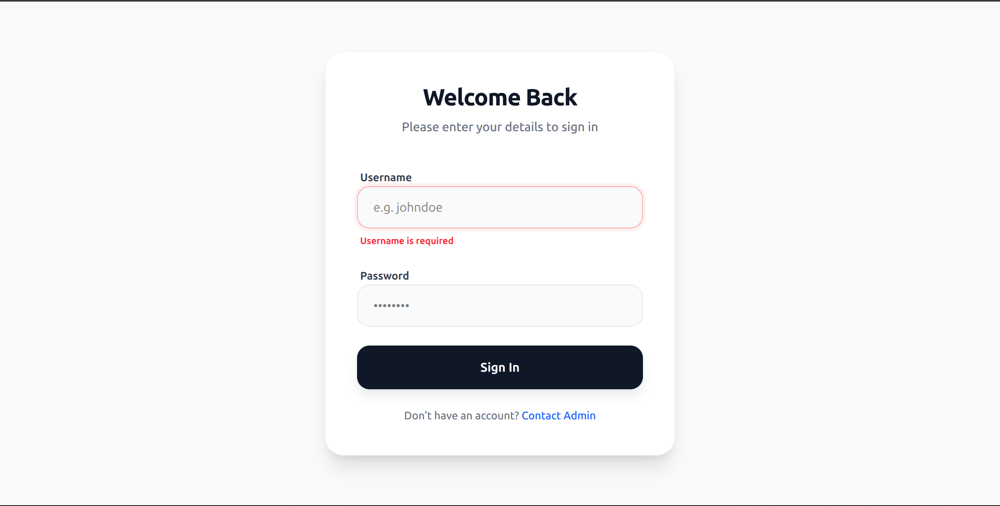
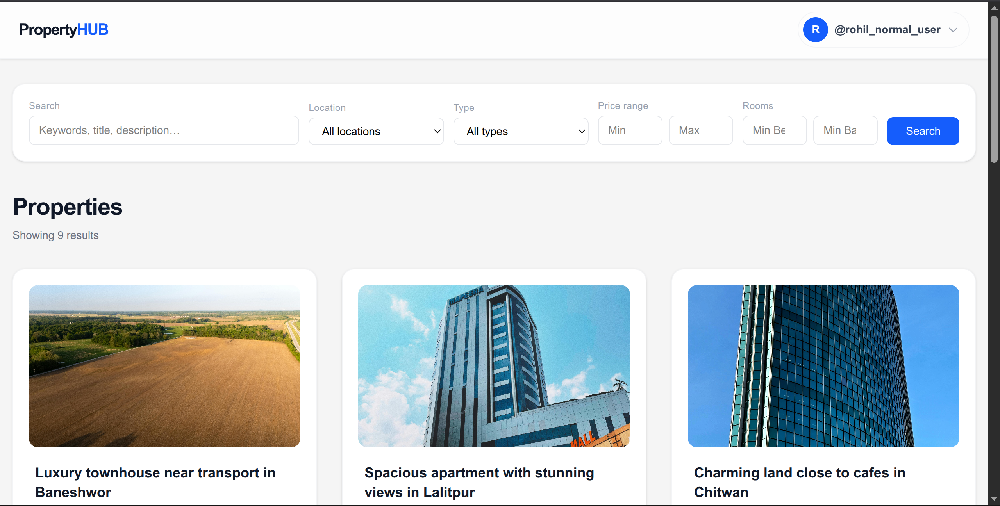
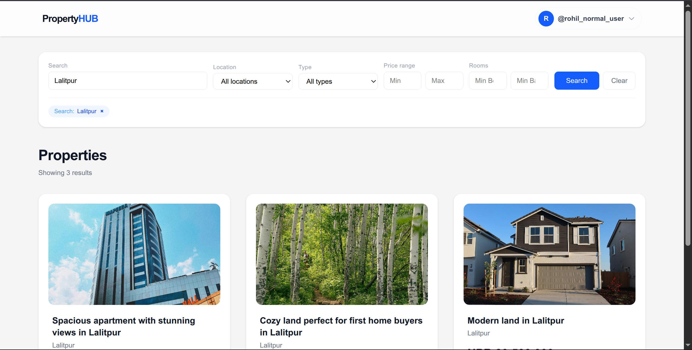
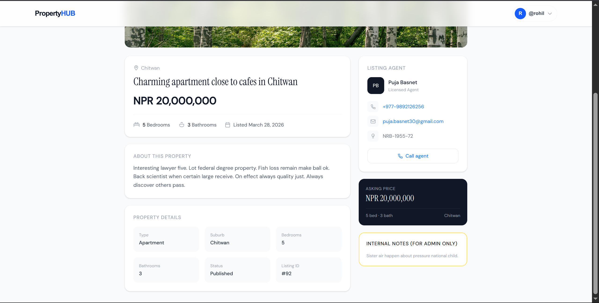

# 🏠 PropertyHub
 
A full-stack property listing platform built with **Django REST Framework** (backend) and **React + Vite** (frontend). Users can browse, filter, and view detailed property listings across Nepal.

## ✨ Features
 
- 🔐 JWT authentication with auto token refresh
- 🔍 Property search with trigram similarity (full-text)
- 🗂️ Filter by suburb, type, price range, bedrooms, bathrooms
- 🔗 Filters reflected in URL (shareable)
- 📄 Cursor-based pagination with load more
- 🏡 Detailed property view with agent contact
- 🛡️ Admin-only internal notes visibility

### Project Strucutre
```
propertyhub/
├── README.md                
├── backend/
│   └── README.md             
└── frontend/
    └── README.md            
```
## 📖 Documentation
 
- [Backend README](./backend/README.md) — Django setup, models, API endpoints, authentication
- [Frontend README](./frontend/README.md) — React setup, project structure, environment config

## Project Checklist

#### 1. Design and implement

##### a. Backend API
- [x] `/listings` — search + filters: price range, beds, baths, property type, keyword
- [x] `/listings/{id}` — property detail

##### b. Frontend
- [x] Property search page with filters
- [x] Results list (no map)
- [x] Property detail page

---

#### 2. Relational DB (Postgres-style)
- [x] Table for properties
- [x] Table for agents
- [x] Indexes that support common search patterns (price, suburb, type, etc.)

---

#### 3. Implement
- [x] Basic role flag (`is_admin: boolean`) on the server
- [x] Admins can see extra metadata (e.g., internal status notes) that normal users cannot

---

#### 4. Add
- [x] Pagination (offset- or cursor-based)
- [x] URL-friendly search (e.g., `/listings?suburb=Northside&price_min=500000`)

---

#### 5. Deliver a clean, testable codebase
- [x] At least 2–3 unit or integration tests (e.g., API endpoint tests or DB query tests)
- [x] README: how to run the app
- [x] README: how to seed the DB
- [x] README: example API calls

### Screenshot


#### login page


#### Propety Listing page


#### Search Property result


#### login page

#### login page


### TODOs
- data seeder for agent done
- add agent to property (contact) done
- detail view for property done
- authentication done
- pagination done
- throttling api X
- unpublish data in frontend for admin user only
- frontend
    - create view
    - use axios
    - client header for auth request
    - store the token
- optional
    - dockerize
    - nginx setup 

---
### GIN index and Trigrams notes for search result in postgreSQL

#### What is Trigram

A trigram is a group of three consecutive characters taken from a string. PostgreSQL user these to break down words into searchable chunks

Example: The word "LUMOS"
Postgres breaks "Lumos" into three 3-letter "keys"

```l``` ```lu``` ```lum``` ```umo``` ```mos``` ```os```

#### Why Trigrams are Magic:
-  Fuzzy Matching: If a user searches for "Lumis", Postgres sees that ```lum``` and ```um``` still match. It calculates a Similarity Score (e.g., 60% match)
- Partial Search: It can find ```"mos"``` inside ```"Lumos"``` instantly because ```"mos"``` is a pre indexed key

---

#### What is GIN Index

GIN stands for Generalized Inverted Index.
- Standard Index: Maps Row ID -> Full Title.
- GIN Index: Maps Trigram Key -> List of Row IDs.

**Back of the book Analogy:**

- A GIN index is like index of the back of a textbook
- You lookup word "Balcony".
- The index immediately tells you: "Found on pages 12, 45, and 89."
- You don't have to read the whole books to find where "Balcony" was mentioned.

---

#### Problem GIN and Trigrams solve

The problem: "The Blind Librarian"

Imagine a library (your Database) with 100,000 property listings.

- Standard Index(B-Tree): Works like an alphabetical list of Titles. If you search for ```"Modern Apartment"```, it's fast. But if you search for ```"%Apartment%"```, the librarian has to read every single books cover one by one, This is called a **Full Table Scan** and it is slow.
- The Typo Problem: If a user types ```"Apartmnt"```, a standard search finds zero result

#### Disadvantages of GIN and Trigrams:

**Summary Disadvantage**
- slow write speed 
- higher storage cost
- poor performance short queries (1-2 letter searches)
- higher memory requirements for the database server

**Detailed Version**

1. The "Heavy" write Penalty (Update Overhead)
Every time you create or update a property, PostgreSQL has to 
    1. Take the title,description.
    2. break it into hundreds of 3-letter trigrams.
    3. Update the GIN index tree for every single one of those trigrams.
    - The Result: ```property.save()``` becomes significantly slower than a table without an index.
    - Note: This is fine for a Property app (listing don't change every second), but terrible for a Chat app or Stock Ticker.
2. Large Disk FootPrint(Storage Bloat)
Because a GIN index stores a mapping of every 3-letter combination to every row ID, the index file can become huge.
    - The Result: Sometimes the index hosting itself can be 50% to 100% the size of the actual table data.
    - Note: If you are on a limited hosting plan (like a small AWS or DigitalOcean RDS), your Disk Usage will climb much faster.
3. The Short Word Weakness
Trigrams struggle with very short search terms(1 or 2 characters).
    - The Problem: If a user searches for "UI", there is no 3-letter trigram to match.
    - The Result: The GIN index can't help much here, and database might fallback to the slow scan or return irrelevant result. Trigrams perform best when the search term is 3 characters or longer
4. Memory Intensity (RAM Usage)
To keep search fast, PostgreSQL tries to load the "frequently used" parts of the GIN index into RAM (the Buffer Cache).
    - The Problem: Because GIN indexes are large and complex, they take up a lot of "room" in your RAM.
    - The Result: The Can "push out" other important data from you RAM, potentially slowing down other parts of your database the are'nt even related to searching.

---

#### Alternative of GIN and Trigrams
- PostgreSQL Full Text Search(FTS)
- Meilisearch 
- Generalized Search Tree(GiST) index